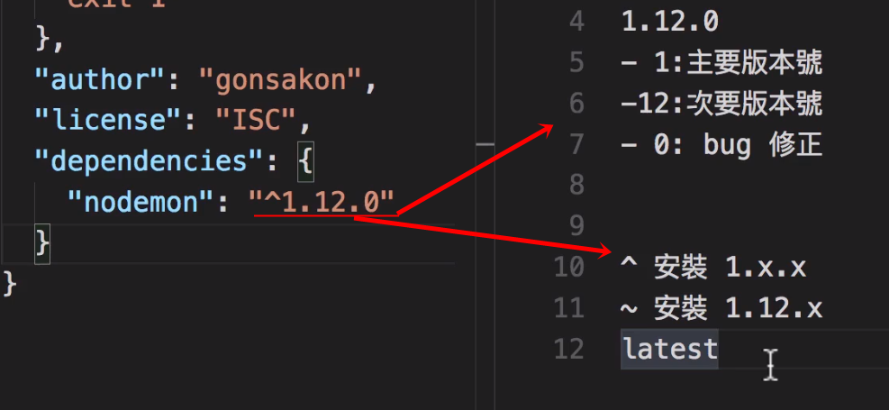

## 安裝與開始

#### 安裝資源
- 安裝 node : <a href="https://nodejs.org/en/">node安裝</a>
- 選擇 LTS(Long Term Support)版本 :因資源與討論較多
- 安裝完可以用 : node -v 與 npm -v (或--version)觀看版本,也可確定安裝成功

#### 開始專案
- 建立專案資料夾
- 使用 cmd 進入 : cd 你的路徑
- 使用 npm init 做出 package.json (方便管理模組 與 執行)
- 安裝 nodemon 以方便執行,當檔案進行更改,會自動更新 : npm install nodemon -g
    - -g : 代表安裝在電腦內部,可在任一資料夾執行
    - -save : 安裝在本專案資料夾內
    - -save-dev : 安裝在本專案資料夾內用於測試或輔助
- 版本說明 : 
    - 在 package.json 會看到:
    ```
    "dependencies": {
        "body-parser": "^1.18.3",
        "ejs-locals": "^1.0.2",
        "express": "^4.16.3"
    }
    ```
    - 說明 : 


- 恭喜完成開始專案

#### express-generator
- 用意 : 更加快速產生express專案
- 請參考 express 官網 : http://expressjs.com/zh-tw/starter/generator.html
